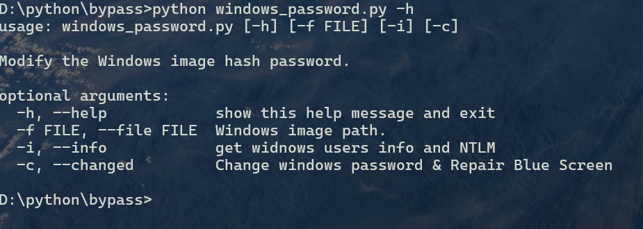
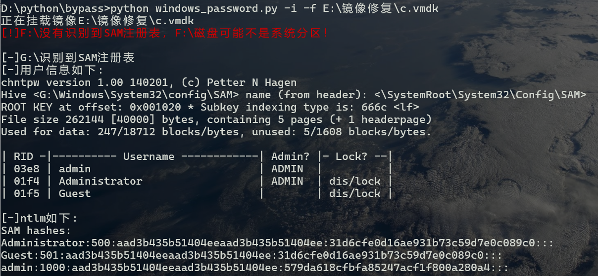
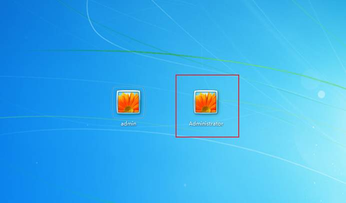
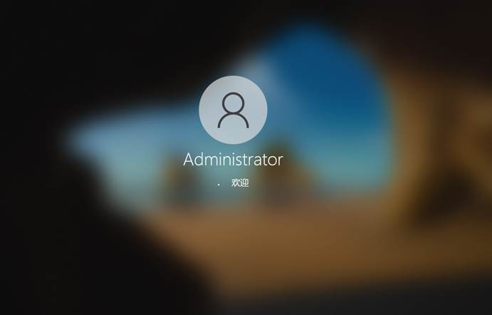
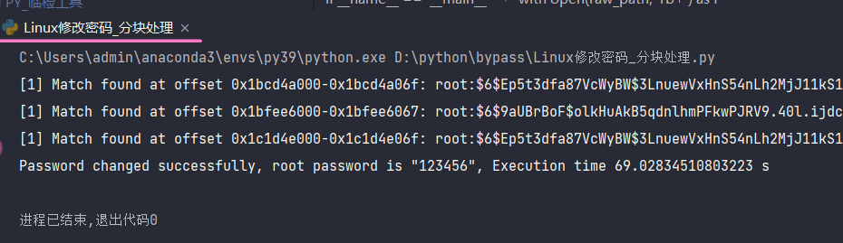
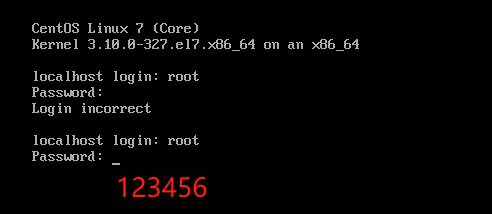

## windows

先解压，使用python运行脚本

-i 参数读取SAM数据库、-c清除密码

-i读取的NTLM可以使用hashcat、join等工具破解，ps：31D6CFE0D16AE931B73C59D7E0C089C0 为空密码

解密SAM，需要SYSTEM中的密钥，域控文件NTDS.dit解密需要SYSTEM、SECURITY注册表

vmware仿真启动后多出管理员用户并且为空密码。

测试Windows10（如果只有Administrator用户会直接进入系统）

目前以测试Windows7、windows10版本主流raw格式、VMDK格式镜像文件。

## linux

使用分块处理大的镜像文件，20GB一分钟，具体与计算机性能相关，可适当修改buffer_size值,建议为512的倍数：

成功修改密码为123456，实际成功测试vmdk、raw格式镜像。

